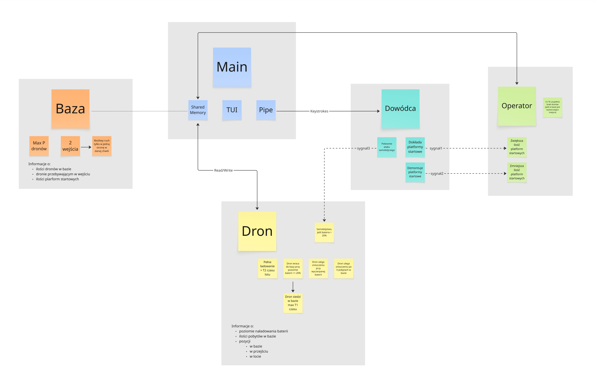

# Raport z Projektu: Rój Dronów

## 1. Założenia projektowe i opis ogólny

Celem projektu było stworzenie symulacji roju autonomicznych dronów działających w systemie wieloprocesowym. System składa się z bazy (platformy startowej), w której drony ładują baterie, oraz przestrzeni powietrznej, w której wykonują loty.

Główne założenia symulacji:

- **Wieloprocesowość**: Każdy dron, operator bazy oraz dowódca systemu to osobne procesy.
- **Synchronizacja**: Dostęp do bazy (ograniczona pojemność) oraz wąskich wejść (ruch jednokierunkowy) jest synchronizowany za pomocą semaforów.
- **Komunikacja**: Procesy komunikują się poprzez pamięć dzieloną (stan dronów, parametry bazy) oraz sygnały (zarządzanie platformami, ataki samobójcze).
- **Cykl życia drona**: Start -> Lot (wyczerpywanie baterii) -> Powrót (przy <20% baterii) -> Ładowanie -> Start. Dron ulega zniszczeniu po wyczerpaniu baterii do 0% lub po wykonaniu określonej liczby cykli (wizyt w bazie).

Udało się zrealizować w pełni funkcjonalną symulację zgodną z opisem zadania, wzbogaconą o interfejs tekstowy (TUI) wizualizujący stan roju w czasie rzeczywistym.

## 2. Architektura

System został zaprojektowany w architekturze wieloprocesowej, gdzie poszczególne elementy symulacji działają jako niezależne procesy systemowe w systemie Linux. Główny nacisk położono na synchronizację dostępu do zasobów współdzielonych.

**Główne komponenty systemu:**

1.  **Główny Proces (Main / UI)**:
    - Odpowiada za przygotowanie środowiska: inicjalizację kluczy IPC, alokację pamięci dzielonej oraz utworzenie zestawu semaforów.
    - Uruchamia procesy zarządcze (Operator, Dowódca) oraz początkową pulę procesów Dronów.
    - Odpowiada za warstwę prezentacji: cyklicznie odczytuje stan roju z pamięci dzielonej i wyświetla go w terminalu przy użyciu biblioteki `termbox2`.
    - Obsługuje wejście użytkownika i przekazuje komendy do Dowódcy za pomocą łącza nienazwanego (`pipe`).

2.  **Pamięć Dzielona (System V Shared Memory)**:
    - Stanowi centralny magazyn danych dostępny dla wszystkich procesów.
    - Przechowuje:
      - Tablicę struktur `DroneInfo` (ID, PID, poziom baterii, stan, liczba cykli).
      - Strukturę `BaseState` (obecna liczba dronów, maksymalna pojemność, docelowa liczebność).
      - Bufor powiadomień dla interfejsu użytkownika.

3.  **Mechanizmy Synchronizacji (Semafory System V)**:
    - `SEM_BASE_CAPACITY`: Semafor licznikowy pilnujący, aby w bazie nie przebywało więcej dronów niż wynosi limit $P$.
    - `SEM_PASSAGE_1` / `SEM_PASSAGE_2`: Semafory binarne symulujące wąskie gardła (wejścia/wyjścia) - zapewniają wyłączny dostęp do śluzy.
    - `SEM_SHM_ACCESS`: Semafor binarny pełniący rolę muteksu dla operacji zapisu/odczytu w pamięci dzielonej.
    - `SEM_LOG_ACCESS`: Zapewnia atomowość zapisu do pliku logów przez wiele procesów jednocześnie.

4.  **Operator (Operator Manager)**:
    - Proces działający w tle, odpowiedzialny za utrzymanie liczebności roju.
    - Obsługuje sygnały czasu rzeczywistego (`SIGRTMIN`) sterujące dodawaniem lub usuwaniem platform (zmiana pojemności bazy).
    - Monitoruje liczbę aktywnych dronów i w razie potrzeby tworzy nowe procesy potomne (`fork()`), aby uzupełnić straty.

5.  **Dowódca (Commander Manager)**:
    - Pełni rolę pośrednika między interfejsem użytkownika a logiką sterowania.
    - Odbiera znaki sterujące z potoku (`pipe`) i tłumaczy je na odpowiednie sygnały systemowe wysyłane do Operatora (zmiana platform) lub bezpośrednio do Dronów (sygnał ataku `SIGKILL`).

6.  **Drony (Drone Workers)**:
    - Niezależne procesy realizujące cykl życia pojedynczego drona.
    - Implementują maszynę stanów: `IN_BASE` (ładowanie) -> `IN_PASSAGE` (wylot) -> `IN_FLIGHT` (rozładowywanie) -> `IN_PASSAGE` (powrót).
    - Samodzielnie podejmują decyzje o powrocie do bazy (niski stan baterii) lub zakończeniu działania (limit cykli, zniszczenie).

## 3. Napotkane problemy

- **Deadlocki przy zamykaniu**: Początkowo proces czyszczenia (cleanup) usuwał semafory przed zakończeniem wątków/procesów próbujących logować zdarzenia, co prowadziło do zawieszenia się aplikacji przy wyjściu. Rozwiązano to poprzez synchroniczne oczekiwanie na zakończenie wszystkich procesów potomnych (`wait()`) przed usunięciem zasobów IPC.
- **Synchronizacja logowania**: Wymagane było stworzenie bezpiecznego wątkowo mechanizmu logowania do pliku, aby procesy nie nadpisywały swoich komunikatów. Zastosowano dedykowany semafor `SEM_LOG_ACCESS`.
- **Obsługa sygnałów**: Konieczne było precyzyjne zdefiniowanie zachowania procesów na sygnały `SIGRTMIN` (dodawanie/usuwanie platform), aby uniknąć błędów przy modyfikacji pojemności bazy w trakcie działania symulacji.

## 4. Elementy specjalne i dodatkowe

- **Interfejs TUI**: Zastosowano bibliotekę `termbox2` do stworzenia czytelnego interfejsu w terminalu, pokazującego listę dronów, ich stan (bateria, aktywność), oraz status bazy.
- **System logowania**: Wszystkie kluczowe zdarzenia (start, lądowanie, ataki, zmiany konfiguracji) są zapisywane w pliku `simulation.log` z dokładnymi znacznikami czasu.
- **Dynamiczne zarządzanie**: Możliwość interaktywnego dodawania/usuwania platform oraz wysyłania rozkazów ataku za pomocą klawiatury w trakcie trwania symulacji.

## 6. Przeprowadzone Testy

Zgodnie z wymaganiami przeprowadzono serię testów weryfikujących poprawność działania symulacji.

### Test 1: Pojemność Bazy i Ruch Jednokierunkowy

- **Cel**: Sprawdzenie, czy liczba dronów w bazie nie przekracza połowy całkowitej liczby oraz czy przestrzegana jest zasada wąskiego gardła.
- **Przebieg**: Uruchomiono symulację z dużą liczbą dronów. Obserwowano licznik dronów w bazie w TUI oraz logi.
- **Wynik**: Licznik nigdy nie przekroczył wartości `P = N/2`. Drony oczekiwały na semaforze wejściowym/wyjściowym, a logi potwierdziły sekwencyjny dostęp.

### Test 2: Cykl Baterii i Powrót

- **Cel**: Weryfikacja, czy drony wracają do bazy przy 20% baterii i czy czas lotu jest zgodny z założeniami.
- **Przebieg**: Obserwacja pojedynczego drona.
- **Wynik**: Dron w stanie `FLY` tracił baterię. Po osiągnięciu 20% status zmieniał się na powrót, a następnie `BASE` (ładowanie). Logi potwierdziły: "Drone X returning to base (Battery: 20%)".

### Test 3: Uzupełnianie Roju (Operator)

- **Cel**: Sprawdzenie, czy operator uzupełnia braki w roju co czas $T_k$.
- **Przebieg**: Wysłano sygnał zabicia do kilku dronów.
- **Wynik**: Po upływie czasu $T_k$, operator wykrył brakujące jednostki i stworzył nowe drony, przywracając liczebność roju do wartości docelowej.

### Test 4: Atak Samobójczy (Dowódca)

- **Cel**: Weryfikacja sygnału ataku i ignorowania go przy niskim stanie baterii.
- **Przebieg**: Wysłano komendę ataku do drona z pełną baterią oraz do drona z baterią < 20%.
- **Wynik**: Dron naładowany przeszedł w stan `DESTROYED`. Dron rozładowany zignorował rozkaz (log: "ignored kill signal (Low Battery)").

### Test 5: Zarządzanie Platformami

- **Cel**: Sprawdzenie dynamicznej zmiany pojemności bazy.
- **Przebieg**: Użyto klawiszy 'a' (add) i 'r' (remove).
- **Wynik**: Klawisz 'a' podwoił pojemność bazy i docelową liczbę dronów. Klawisz 'r' zmniejszył pojemność o połowę. Logi potwierdziły zmianę wartości semafora pojemności.

## 6. Linki do istotnych fragmentów kodu

Poniżej znajdują się odnośniki do fragmentów kodu realizujących wymagane mechanizmy systemowe (zgodnie z punktem 5.2 wymagań).

### a. Tworzenie i obsługa plików

Logowanie zdarzeń do pliku `simulation.log` z użyciem `fopen`, `fprintf`, `fclose`:
[src/utils.c](https://github.com/StaZarycki/PK_SO_PROJECT_DRONE_SWARM/blob/4cfa0c1beb060b58d93f88d9e4b1e82c17bf2859/src/utils.c#L101C1-L125C2) - funkcja `log_event`.

### b. Tworzenie procesów

Użycie `fork()`, `execl()` oraz `wait()`/`waitpid()` do zarządzania procesami dronów, operatora i dowódcy:
[src/drone_manager.c](https://github.com/StaZarycki/PK_SO_PROJECT_DRONE_SWARM/blob/4cfa0c1beb060b58d93f88d9e4b1e82c17bf2859/src/drone_manager.c#L11C1-L77C2) - funkcja `spawn_drones`.
[src/main.c](https://github.com/StaZarycki/PK_SO_PROJECT_DRONE_SWARM/blob/4cfa0c1beb060b58d93f88d9e4b1e82c17bf2859/src/main.c#L84C1-L120C2) - funkcja `cleanup` (oczekiwanie na dzieci).

### c. Tworzenie i obsługa wątków

Projekt oparty jest na procesach (zgodnie z wymogiem symulacji na procesach), nie wykorzystuje `pthread`. Synchronizacja odbywa się za pomocą semaforów System V.

### d. Obsługa sygnałów

Rejestracja i obsługa sygnałów `SIG_ADD_PLATFORM`, `SIG_REMOVE_PLATFORM`, `SIG_KILL` (RT signals) oraz `SIGTERM`:
[src/operator_manager.c](https://github.com/StaZarycki/PK_SO_PROJECT_DRONE_SWARM/blob/4cfa0c1beb060b58d93f88d9e4b1e82c17bf2859/src/operator_manager.c#L128C2-L133C45) - funkcja `run_operator` i `handle_op_signal`.
[src/drone_worker.c](https://github.com/StaZarycki/PK_SO_PROJECT_DRONE_SWARM/blob/4cfa0c1beb060b58d93f88d9e4b1e82c17bf2859/src/drone_worker.c#L25C1-L43C2) - funkcja `handle_attack_signal`.

### e. Synchronizacja procesów (Semafory)

Użycie `semget`, `semop`, `semctl` do synchronizacji dostępu do bazy i sekcji krytycznych:
[src/utils.c](https://github.com/StaZarycki/PK_SO_PROJECT_DRONE_SWARM/blob/4cfa0c1beb060b58d93f88d9e4b1e82c17bf2859/src/utils.c#L45C1-L73C2) - funkcje `lock_sem`, `unlock_sem`.
[src/drone_worker.c](https://github.com/StaZarycki/PK_SO_PROJECT_DRONE_SWARM/blob/4066d18e3773d5a4663be5919a9f2f7f14b4b202/src/drone_worker.c#L120C1-L249C2) - synchronizacja wejścia/wyjścia z bazy.

### f. Łącza nienazwane (Pipe)

Komunikacja między procesem głównym (UI) a procesem dowódcy (Commander) za pomocą `pipe()`:
[src/main.c](https://github.com/StaZarycki/PK_SO_PROJECT_DRONE_SWARM/blob/4066d18e3773d5a4663be5919a9f2f7f14b4b202/src/main.c#L50C1-L56C2) - funkcja `init_pipe`.
[src/commander_manager.c](https://github.com/StaZarycki/PK_SO_PROJECT_DRONE_SWARM/blob/4066d18e3773d5a4663be5919a9f2f7f14b4b202/src/commander_manager.c#L39C7-L52C8) - odczyt rozkazów z potoku.

### g. Pamięć dzielona (Shared Storage)

Współdzielenie stanu roju między wszystkimi procesami za pomocą `shmget`, `shmat`:
[include/types.h](https://github.com/StaZarycki/PK_SO_PROJECT_DRONE_SWARM/blob/4066d18e3773d5a4663be5919a9f2f7f14b4b202/include/types.h#L58C1-L65C17) - definicja struktury `SharedStorage`.
[src/utils.c](https://github.com/StaZarycki/PK_SO_PROJECT_DRONE_SWARM/blob/4066d18e3773d5a4663be5919a9f2f7f14b4b202/src/utils.c#L89C1-L99C2) - funkcja `attach_shm`.

### h. Kolejki komunikatów

W tym projekcie do komunikacji wykorzystano potoki (pipes) oraz sygnały zamiast kolejek komunikatów, co było wystarczające dla założeń projektowych.

### i. Gniazda

Projekt działa lokalnie i nie wykorzystuje komunikacji sieciowej.
